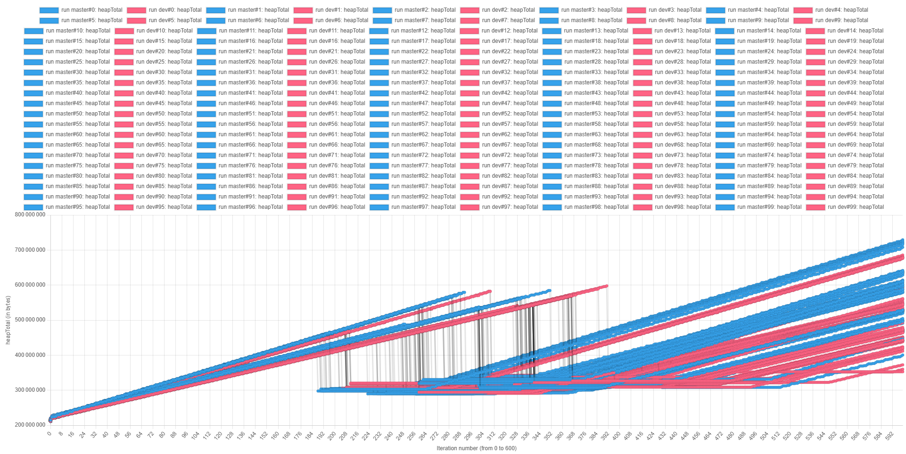
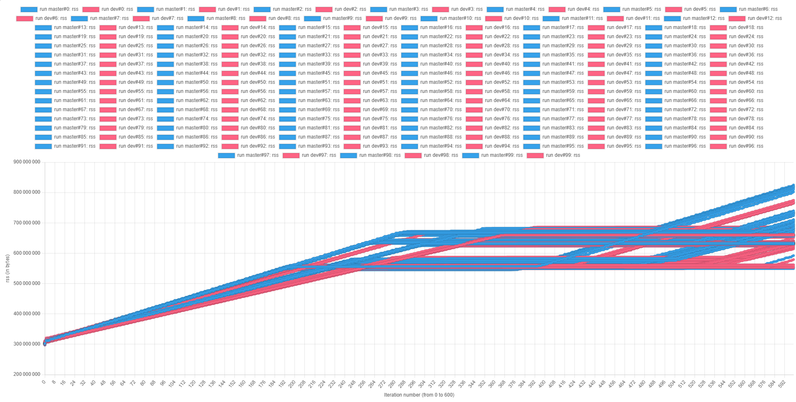
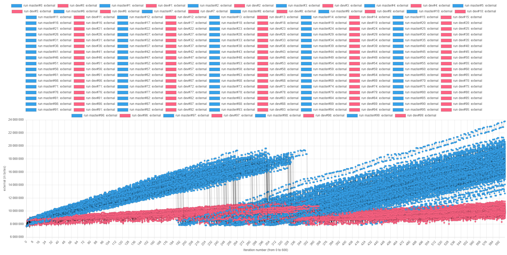
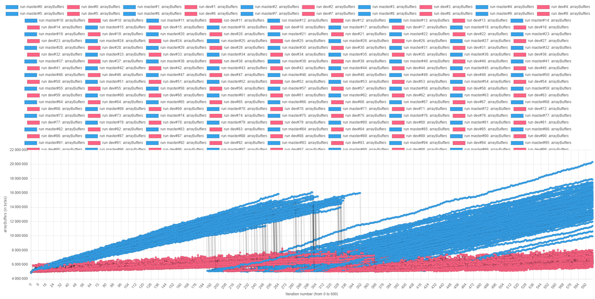

# TypeORM Memory Benchmark

## Benchmark

With this benchmark, I want to measure and compare the memory usage of two TypeORM versions:

- The latest release (at this time, version 0.3.20)
- The changes included in the [PR #10349](https://github.com/typeorm/typeorm/pull/10349)

My objective is to see if we can detect a difference in the trend of the memory usage between the two different versions of TypeORM.

### 1. Protocol

To retrieve memory usage, the benchmark uses `process.memoryUsage()` (for further details, see the section **How `process.memoryUsage()` works** below).

The benchmark runs the same script **100 times** with `npm run` in a shell loop.

The script contains the following workflow:

1. Initialize the memory usage array
2. Run the same steps **200 times** in a `for` loop

   The steps are as follows:

   1. Call `process.memoryUsage()` and append the results to the array
   2. Fetch the first entry with `findOne()`
   3. Call `process.memoryUsage()` and append the results to the array
   4. Fetch the first 100 entries with `find()`
   5. Call `process.memoryUsage()` and append the results to the array

3. Append the memory usage array to the JSON file content (using the result of `Date.now()` as the key)
4. Update the content of the JSON file

We end up storing 600 results of `process.memoryUsage()` for each script call.

This benchmark has to run twice against each target: once against the latest release and once against the targeted changes.

#### Why run the same script **100 times** and the steps **200 times**?

Even if these numbers are arbitrary, they are meant to create a large enough statistical sample to detect trends in memory consumption.

Node.js is garbage collected, and this process is not deterministic. This means it will never run exactly the same way between two runs.

This approach helps make trends in memory usage more visible.

#### Why call the Repository API `findOne()` and `find()` methods?

The PR #10349 modifies the code used by the TypeORM query builder API (and, by extension, the Repository API).

This means the tests can focus on the usage of the Repository API, which is easier to set up and will be as impacted by the changes as the query builder API.

#### How `process.memoryUsage()` Works

From the [official documentation](https://nodejs.org/docs/latest-v22.x/api/process.html#process_process_memoryusage):

> - `heapTotal` and `heapUsed` refer to V8's memory usage.
> - `external` refers to the memory usage of C++ objects bound to JavaScript objects managed by V8.
> - `rss`, Resident Set Size, is the amount of space occupied in the main memory device (a subset of the total allocated memory) for the process, including all C++ and JavaScript objects and code.
> - `arrayBuffers` refers to memory allocated for ArrayBuffers and SharedArrayBuffers, including all Node.js Buffers. This is also included in the external value. When Node.js is used as an embedded library, this value may be 0 because allocations for ArrayBuffers may not be tracked in that case.

#### Content of the Database

### 2. Results

Legend summary:

- Blue dots represent iterations against the latest version.
- Red dots represent iterations against the PR changes.

#### `heapUsed`



#### `heapTotal`


#### `rss`



#### `external`



#### `arrayBuffers`



### 3. Conclusions

From the charts, we can see the trends in memory usage, with a clear difference between the two versions.

Even better, we can observe from the difference in the trends that memory usage is improving thanks to the changes in PR #10349.

This is interesting because this PR introduces a lot of caching to prevent running the same code multiple times. My initial assumption was that memory usage would increase.

These results can be explained easily: before the changes, we were running a lot of code multiple times. The memory allocations that were happening in these parts of the code had to be garbage collected at some point.

Thanks to the optimizations, caching data actually reduces the total number of allocations.

## How to Use This Repository

Requirements:

- Node 22 or NVM (with the `.nvmrc` file provided)
- Docker
- Docker Compose

### Interact with the Stats

> [!WARNING]  
> The stats frontend is not optimized for performance, so it might take a while to load and may not be responsive.  
> You can tweak the JavaScript code in `stats/stats.html` to remove data you don't want to see.

Run this command:

```sh
docker-compose up -d http-server
```

Go to http://localhost:8080/ and pick the stat you want to see in the list.

### Run the benchmark

By default, the benchmark will run against release 0.3.20 of TypeORM.

Start by installing the dependencies:

```sh
pnpm install
```

To run the benchmark, use the following commands:

```sh
docker-compose up -d
rm ./stats/stats-master.json
pnpm run bench:all:master
```

Depending on your machine, the script will run for more or less than half an hour.

The script will recreate the file `./stats/stats-master.json` (if it was deleted) and append the results of the benchmark for each run.

This file is automatically used by the frontend to display the results.

#### Test Against Another Version of TypeORM

If you want to test against the version of TypeORM for PR #10349, run the following commands:

```sh
pnpm add ./typeorm-pr-10349.tgz
rm ./stats/stats-dev.json
pnpm run bench:all:dev
```

The script will create a new file in ./stats/stats-master.json that will contain the results of the benchmark.

This file will be used by the stats frontend to display the results.

> [!NOTE]  
> You can build your own version of TypeORM by following the instructions in the [TypeORM repository](https://github.com/typeorm/typeorm/blob/master/DEVELOPER.md#bui²lding) to create a tarball.
